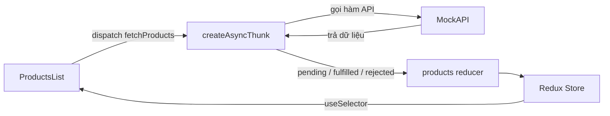

# Redux Toolkit với React

Đây là dự án thực hành quản lý danh sách sản phẩm bằng React, Redux Toolkit, React Redux và Axios. Dữ liệu sản phẩm được tải bất đồng bộ từ API, lưu vào Redux Store rồi hiển thị trên giao diện.

## Công nghệ sử dụng

- React: xây dựng giao diện.
- Redux Toolkit: tạo store, slice, reducer và async thunk.
- React Redux: kết nối React với Redux qua `Provider`, `useDispatch` và `useSelector`.
- Axios: gửi HTTP request đến API.
- Vite: chạy development server và build dự án.

## Redux Toolkit là gì?

Redux Toolkit, thường viết tắt là RTK, là bộ công cụ chính thức để viết Redux. RTK giúp giảm code lặp lại và cung cấp sẵn các API thường dùng:

- `configureStore`: tạo Redux Store.
- `createSlice`: tạo reducer và action trong cùng một nơi.
- `createAsyncThunk`: xử lý tác vụ bất đồng bộ như gọi API.
- Immer: cho phép cập nhật state bằng cú pháp giống mutation nhưng vẫn tạo state mới bất biến.
- Redux DevTools và các middleware cần thiết được cấu hình sẵn.

## Cấu trúc dự án

```text
src/
├── app/
│   └── store.js
├── features/
│   └── products/
│       ├── productSlice.js
│       └── productsAPI.js
├── products/
│   └── ProductsList.jsx
├── App.jsx
├── index.css
└── main.tsx
```

Vai trò của từng file:

- `store.js`: tạo store và khai báo các reducer.
- `productSlice.js`: quản lý state, action, reducer, async thunk và selector của products.
- `productsAPI.js`: thực hiện request lấy sản phẩm từ API.
- `ProductsList.jsx`: dispatch thunk, đọc state và hiển thị sản phẩm.
- `main.tsx`: bọc ứng dụng bằng `Provider` để mọi component truy cập được store.

## Luồng dữ liệu



Redux sử dụng luồng dữ liệu một chiều:

1. Component gửi action bằng `dispatch`.
2. Reducer nhận action và cập nhật state.
3. Store lưu state mới.
4. Component lấy state bằng `useSelector` và render lại.

## Cài đặt và chạy dự án

Yêu cầu: máy đã cài Node.js và npm.

```bash
npm install
npm run dev
```

Các lệnh có sẵn:

```bash
npm run dev      # Chạy development server
npm run build    # Kiểm tra TypeScript và build production
npm run lint     # Chạy ESLint
npm run preview  # Xem thử bản production đã build
```

## 1. Tạo Redux Store

Store được tạo trong `src/app/store.js`:

```js
import { configureStore } from "@reduxjs/toolkit";
import productReducer from "../features/products/productSlice";

export const store = configureStore({
  reducer: {
    products: productReducer,
  },
});
```

`configureStore` nhận một object `reducer`. Khóa `products` quyết định vị trí state của feature trong root state:

```js
state.products
```

Cấu trúc state hiện tại:

```js
{
  products: {
    items: [],
    status: "idle",
    error: null
  }
}
```

Khi thêm feature mới, khai báo reducer mới trong object `reducer`:

```js
export const store = configureStore({
  reducer: {
    products: productReducer,
    users: userReducer,
  },
});
```

## 2. Cung cấp Store cho React

Trong `src/main.tsx`, ứng dụng được bọc bởi `Provider`:

```tsx
import { Provider } from "react-redux";
import { store } from "./app/store.js";

<Provider store={store}>
  <App />
</Provider>
```

`Provider` đưa store vào React Context. Các component nằm bên trong mới có thể sử dụng `useDispatch` và `useSelector`.

## 3. Tạo Slice

Slice là một phần state cùng các reducer chịu trách nhiệm cập nhật phần state đó.

```js
const initialState = {
  items: [],
  status: "idle",
  error: null,
};

export const productsSlice = createSlice({
  name: "products",
  initialState,
  reducers: {
    addProduct: (state, action) => {
      state.items.push(action.payload);
    },
  },
});
```

Các thuộc tính chính:

- `name`: tên của slice, được dùng để tạo action type.
- `initialState`: trạng thái ban đầu.
- `reducers`: xử lý các action đồng bộ.
- `extraReducers`: xử lý action được tạo bên ngoài slice, thường là action của async thunk.

### Action và payload

RTK tự tạo action creator từ các hàm trong `reducers`:

```js
export const { addProduct } = productsSlice.actions;
```

Có thể dispatch action như sau:

```js
dispatch(addProduct(newProduct));
```

`newProduct` sẽ nằm trong `action.payload`:

```js
addProduct: (state, action) => {
  state.items.push(action.payload);
}
```

### Vì sao có thể viết `state.items.push()`?

Redux yêu cầu không mutate state trực tiếp. Tuy nhiên, `createSlice` sử dụng Immer nên có thể viết:

```js
state.items.push(action.payload);
```

Immer sẽ tạo state mới bất biến ở phía sau. Không nên mutate Redux state bên ngoài reducer.

### Export reducer

Store cần reducer, không phải toàn bộ slice:

```js
export default productsSlice.reducer;
```

## 4. Gọi API với `createAsyncThunk`

Hàm gọi API được tách riêng trong `productsAPI.js`:

```js
import axios from "axios";

export const fetchProductsApi = async () => {
  const response = await axios.get(
    "https://67da02f435c87309f52aafd1.mockapi.io/product",
  );

  return response.data;
};
```

Async thunk được khai báo trong slice:

```js
export const fetchProducts = createAsyncThunk(
  "products/fetchProducts",
  async (_, { rejectWithValue }) => {
    try {
      return await fetchProductsApi();
    } catch (error) {
      return rejectWithValue(error.response?.data ?? error.message);
    }
  },
);
```

Cấu trúc `createAsyncThunk`:

```js
createAsyncThunk(typePrefix, payloadCreator)
```

- `typePrefix`: tiền tố của action type, ví dụ `products/fetchProducts`.
- `payloadCreator`: hàm bất đồng bộ trả về dữ liệu hoặc lỗi.
- Tham số `_`: giá trị được truyền khi dispatch thunk; `_` thể hiện rằng dự án hiện không dùng giá trị đó.
- `rejectWithValue`: tạo rejected action với nội dung lỗi tùy chỉnh trong `action.payload`.

Ví dụ thunk nhận tham số:

```js
export const fetchProductById = createAsyncThunk(
  "products/fetchProductById",
  async (productId) => {
    const response = await axios.get(`/products/${productId}`);
    return response.data;
  },
);

dispatch(fetchProductById(10));
```

## 5. Vòng đời của Async Thunk

Mỗi thunk tự tạo ba action:

| Action | Thời điểm | Việc cần làm |
| --- | --- | --- |
| `fetchProducts.pending` | Request bắt đầu | Đặt trạng thái thành `loading` |
| `fetchProducts.fulfilled` | Request thành công | Lưu dữ liệu và đặt `succeeded` |
| `fetchProducts.rejected` | Request thất bại | Lưu lỗi và đặt `failed` |

Các action này được xử lý bằng `extraReducers`:

```js
extraReducers: (builder) => {
  builder
    .addCase(fetchProducts.pending, (state) => {
      state.status = "loading";
    })
    .addCase(fetchProducts.fulfilled, (state, action) => {
      state.status = "succeeded";
      state.items = action.payload;
    })
    .addCase(fetchProducts.rejected, (state, action) => {
      state.status = "failed";
      state.error = action.payload ?? action.error.message;
    });
}
```

Luồng trạng thái:

```text
idle → loading → succeeded
               ↘ failed
```

## 6. Selector và `useSelector`

Selector là hàm lấy một phần dữ liệu từ Redux state:

```js
export const selectAllProducts = (state) => state.products.items;
export const selectProductsStatus = (state) => state.products.status;
export const selectProductsError = (state) => state.products.error;
```

Component sử dụng selector thông qua `useSelector`:

```jsx
const products = useSelector(selectAllProducts);
const status = useSelector(selectProductsStatus);
const error = useSelector(selectProductsError);
```

Khi giá trị được chọn thay đổi, React Redux sẽ render lại component.

## 7. Dispatch action với `useDispatch`

`useDispatch` trả về hàm `dispatch` của store:

```jsx
const dispatch = useDispatch();
```

Trong dự án, request chỉ được gọi khi state đang ở trạng thái `idle`:

```jsx
useEffect(() => {
  if (status === "idle") {
    dispatch(fetchProducts());
  }
}, [status, dispatch]);
```

Điều kiện `status === "idle"` giúp hạn chế việc gọi API lặp lại khi component render lại.

## 8. Render theo trạng thái request

Giao diện xử lý riêng từng trạng thái:

```jsx
if (status === "loading") {
  content = <div>Loading...</div>;
} else if (status === "succeeded") {
  content = products.map((product) => (
    <div key={product.id}>{product.name}</div>
  ));
} else if (status === "failed") {
  content = <div>{error}</div>;
}
```

Mỗi phần tử được render trong `map()` cần một `key` ổn định, thông thường là `product.id`.

## `reducers` và `extraReducers` khác nhau thế nào?

| `reducers` | `extraReducers` |
| --- | --- |
| Tạo action và reducer cùng lúc | Chỉ phản ứng với action đã tồn tại |
| Thường dùng cho logic đồng bộ | Thường dùng cho async thunk |
| Action được export từ `slice.actions` | Không tạo thêm action creator |

## `dispatch` và selector khác nhau thế nào?

- `dispatch`: gửi yêu cầu thay đổi state.
- Selector: đọc dữ liệu hiện tại từ state.

```jsx
dispatch(fetchProducts());       // Gửi action
useSelector(selectAllProducts);  // Đọc state
```

## Các lỗi thường gặp

### Sai tên biến

JavaScript phân biệt chính xác tên biến:

```js
// Sai vì fetchProduct chưa được khai báo
fetchProduct.fulfilled;

// Đúng
fetchProducts.fulfilled;
```

### Gõ sai tên hook

```js
// Sai
useSelectorO(selector);

// Đúng
useSelector(selector);
```

### Truyền slice thay vì reducer vào store

```js
// Export reducer từ slice
export default productsSlice.reducer;

// Sau đó import reducer vào store
import productReducer from "../features/products/productSlice";
```

### Đọc `response.data` hai lần

Nếu hàm API đã trả về `response.data`:

```js
return response.data;
```

Thunk chỉ cần trả kết quả đó:

```js
return await fetchProductsApi();
```

Không tiếp tục đọc `.data`, nếu không payload có thể trở thành `undefined`.

### Không trả JSX trong `map()`

Khi sử dụng `{}`, cần viết `return`. Có thể dùng `()` để implicit return:

```jsx
products.map((product) => (
  <div key={product.id}>{product.name}</div>
));
```

### Component không nằm trong `Provider`

Nếu component dùng Redux hooks nhưng không được bọc bởi `Provider`, React Redux sẽ không tìm thấy store.

```tsx
<Provider store={store}>
  <App />
</Provider>
```

### Tên key trong store không khớp selector

Nếu store khai báo:

```js
reducer: {
  products: productReducer,
}
```

Selector phải đọc từ `state.products`, không phải `state.product`.

## Gợi ý phát triển tiếp

- Thêm chức năng tạo, sửa và xóa sản phẩm.
- Tách `ProductItem` thành component riêng.
- Hiển thị thông báo lỗi thân thiện và nút tải lại.
- Thêm trạng thái rỗng khi API không có sản phẩm.
- Dùng `createEntityAdapter` khi cần quản lý danh sách lớn theo `id`.
- Dùng RTK Query nếu ứng dụng chủ yếu làm việc với dữ liệu server và cần cache, refetch, loading state tự động.
- Viết typed hooks nếu chuyển toàn bộ dự án sang TypeScript.

## Tóm tắt

Các phần quan trọng nhất của Redux Toolkit trong dự án:

1. `configureStore` tạo store và kết hợp reducer.
2. `Provider` cung cấp store cho cây React.
3. `createSlice` tạo state, reducer và action.
4. `createAsyncThunk` quản lý logic gọi API bất đồng bộ.
5. `extraReducers` xử lý `pending`, `fulfilled` và `rejected`.
6. `useDispatch` gửi action.
7. `useSelector` đọc dữ liệu từ store.
8. Selector giúp tách logic truy cập state khỏi component.

Nắm chắc luồng `Component → dispatch → reducer → store → selector → Component` là nền tảng để sử dụng Redux Toolkit hiệu quả.
